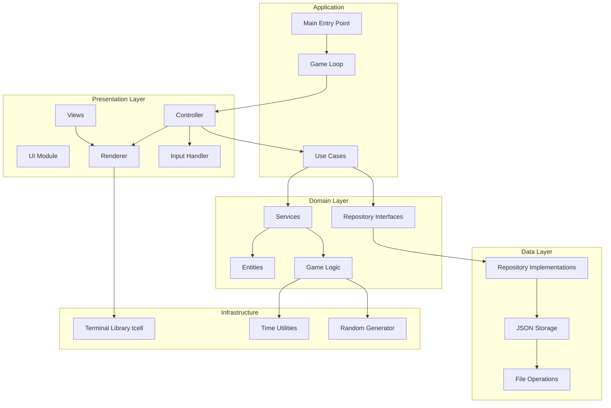

# Архитектурная диаграмма для Rogue-like на Go

## Описание компонентов

### Presentation Layer
- **UI Module**: координация UI компонентов.
- **Renderer**: абстракция для отрисовки игрового состояния в терминале.
- **Controller**: обработка пользовательского ввода и управление потоком игры.
- **Views**: различные экраны (игра, меню, статистика).
- **Input Handler**: чтение и интерпретация нажатий клавиш.

### Domain Layer
- **Entities**: основные структуры данных (Player, Monster, Item, Room, Level, etc.).
- **Services**: сервисы, реализующие игровую логику (генерация, бой, движение).
- **Repository Interfaces**: интерфейсы для доступа к данным (например, GameRepository).
- **Game Logic**: чистые функции игровой механики.

### Data Layer
- **Repository Implementations**: реализации репозиториев для хранения в JSON.
- **JSON Storage**: сериализация/десериализация данных.
- **File Operations**: чтение/запись файлов.

### Infrastructure
- **Terminal Library**: внешняя библиотека для работы с терминалом (tcell).
- **Time Utilities**: утилиты для работы со временем.
- **Random Generator**: генерация случайных чисел.

### Application
- **Use Cases**: основные сценарии приложения (начать новую игру, загрузить игру, сделать ход).
- **Game Loop**: основной цикл игры, связывающий все компоненты.
- **Main Entry Point**: точка входа приложения.

## Поток данных
1. Пользовательский ввод через **Input Handler** передаётся в **Controller**.
2. **Controller** вызывает соответствующий **Use Case**.
3. **Use Case** использует **Services** для изменения состояния **Entities**.
4. Изменённое состояние сохраняется через **Repository Interfaces** в **Data Layer**.
5. **Controller** обновляет **Views** и передаёт данные в **Renderer**.
6. **Renderer** использует **Terminal Library** для отрисовки на экране.